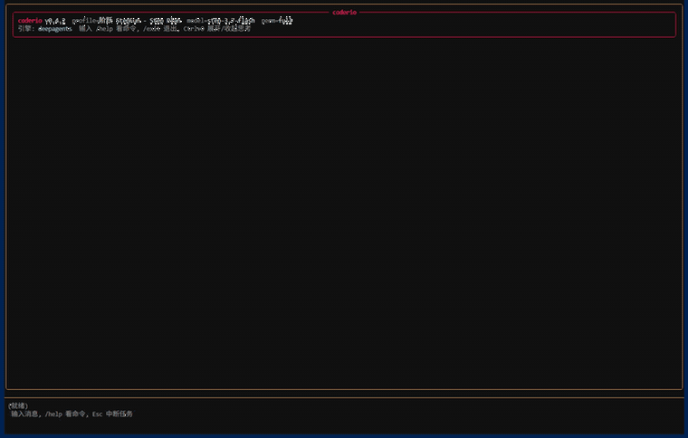
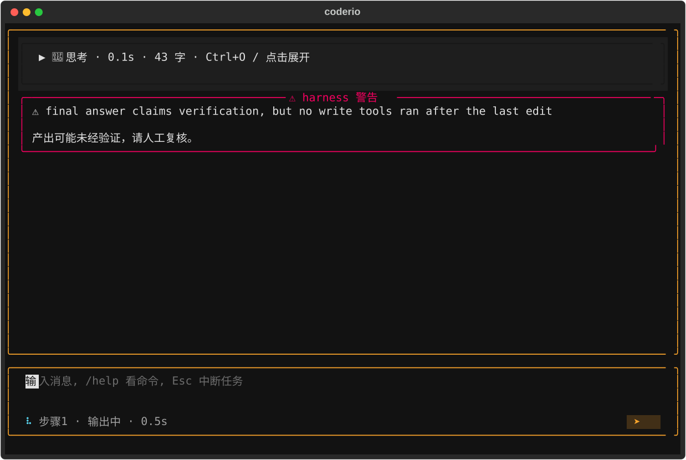
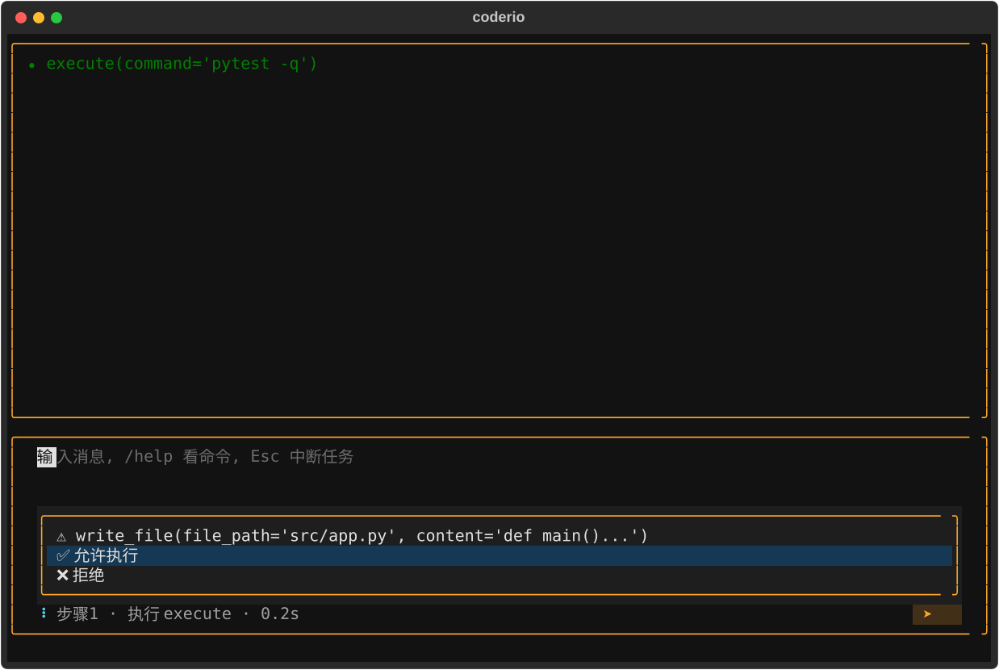
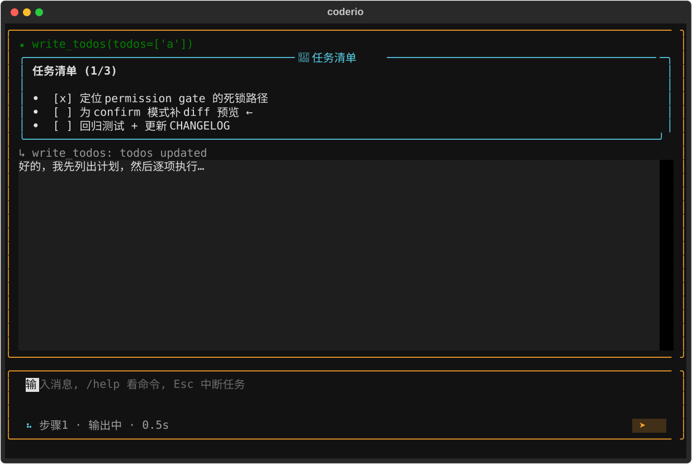

# coderio

**中文** | [English](README_en.md)

> 写了代码没跑过测试就说"完成"？coderio 的 harness 会拦住它。
> 一个**原生支持智谱 GLM / 阶跃 StepFun Coding Plan** 的本地 coding agent——四级权限、多层沙箱、MCP、生命周期 hooks、交互式 TUI。



## 安装

```bash
pip install coderio
coderio    # 首次启动进入 onboarding 向导（选 provider、填 API key、自动探测上下文窗口）
```

要求：Python 3.11+；Windows 需 Git Bash。支持 Linux / macOS。

可选：MCP 外部工具（`.mcp.json`）需要额外依赖——`pip install "coderio[mcp]"`；未安装时 MCP 工具不启用（启动会有提示）。

## 为什么是 coderio

市面上 coding agent 的共同软肋：**模型说"我做完了"，你就得信**。coderio 把这句话变成了结构约束——

### 四道门：agent 骗不了你

| 门 | 行为 |
|---|---|
| **VerifyGate** | 写了代码没跑验证就想结束 → 拦截、强制续跑。解析真实 exit code，**测试失败不算验证通过** |
| **CompletionGate** | TODO 没清完就宣布完成 → 拦截 |
| **GroundingGate** | 引用从未读过的文件下结论 → 拦截 |
| **PlanGate** | 没 TODO 就动手写码 → 软提醒 |

不是提示词软规则，是基于工具调用 ground truth 的系统级控制。开箱即用、带逐级升级与退出码解析的结构化验证——同类终端 agent 中少见。



### 原生支持中文 Coding Plan

智谱 **GLM Coding Plan** 和阶跃 **StepFun Step Plan** 开箱即用（Anthropic 协议直连）——你的订阅额度跑本地 agent，不需要转发、不需要中间层。同时支持 OpenAI / Anthropic / Ollama / 任意 OpenAI 兼容端点，多 profile 一键切换。

### 多模态输入

在消息里引用图片文件路径（`@路径`，或把图片文件拖进终端让路径自动填入输入框），图片会随消息发给支持视觉的模型——截图、UI 设计稿、报错截图，agent 能看图说话、按图改码。注意：路径含空格时请先把文件移到无空格目录（路径解析暂不支持带空格的路径）。

### 多层安全，诚实声明

- 四级权限（plan 只读 / confirm 逐项确认 / auto_edit / full）
- 命令黑名单 + 白名单（防手滑）；Linux bubblewrap OS 级沙箱（防越界写）
- 仓库配置首次信任确认（防克隆恶意仓库）；web_fetch SSRF 防护
- 黑白名单是**防手滑不是防对抗**——对抗性防护靠沙箱 + 权限，恶意代码请用 VM

confirm 模式下每次写入都是一次按键的选择，不读术语、不猜含义：



## 3 分钟上手：你的第一个任务

安装并完成 onboarding 后，启动 TUI 直接说人话：

```bash
coderio
```

输入（示例）：

```
帮我在 tests/ 里找一个失败的测试，修好它，并运行确认通过
```

你会看到：

1. **思考流式展开**（Ctrl+O 随时折叠/展开每轮思考）
2. **工具调用逐行显示**——读了哪些文件、跑了哪些命令，输出截断成一行摘要
3. **TODO 面板**实时更新任务进度（agent 用 write_todos 计划任务时出现）：



4. 结束后是蓝色 **coderio** 面板的最终答复 + 一行"本轮修改的文件"汇总；confirm 模式下每次写盘前会有上面那个纵向菜单
5. 不放心？`/undo` 逐级回滚 agent 的每次写盘，`/think` 展开它刚才在想什么

不想进 TUI？headless 单发同样可以：

```bash
coderio run "统计 src/ 下的 Python 行数并总结" --quiet
```

## 特性一览

- **交互式 TUI**：流式输出、思考折叠（Ctrl+O）、可折叠 TODO 面板、纵向权限菜单、任务中断（Esc）、slash 命令补全、会话管理
- **自定义 slash 命令**：`.coderio/commands/*.md`（项目级/用户级）把提示词模板变成 `/命令`，`$ARGUMENTS` 占位符替换，内置命令不可被遮蔽
- **自定义子代理**：`.coderio/agents/*.md` 定义 `task(subagent_type=...)` 可调的专属人格——只定制"是谁"，能力恒为只读栈
- **文件回滚**：agent 的每次结构化写盘自动快照，`/undo` 一键逐级恢复（改坏文件不再可怕）
- **计划产物**：任务清单自动镜像到 `.coderio/plan.md`，你手动编辑它，下一轮 agent 自动采纳你的版本
- **headless 模式**：`coderio run "任务"` 单次运行（CI / 脚本 / benchmark），退出码分级
- **MCP 支持**：`.mcp.json`（Claude Code 兼容格式）接入外部工具，`coderio mcp` 命令行管理
- **生命周期 hooks**：`[[hooks]]` 在 PreToolUse / PostToolUse / UserPromptSubmit 等事件执行你的命令（exit 2 = 阻断），IO 契约与 Claude Code 兼容
- **skills 三层加载**：bundled + 用户 + 项目层，渐进披露省上下文
- **上下文治理**：自动压缩（60% 窗口触发）、大块 offload、sqlite 检查点跨轮持久化
- **子 agent**：research（只读，双重强制）+ general-purpose（继承主 agent 全部安全层）
- **工程纪律**：1080+ 测试、覆盖率 CI 卡 75% 下限、mypy 硬门、uv.lock 锁定、3 OS × 2 Python CI 矩阵

<details>
<summary><b>配置示例</b>（点击展开）</summary>

```toml
# ~/.coderio/config.toml
[model]
provider_id = "bigmodel_coding_plan"   # 智谱/阶跃 coding plan，或 openai/anthropic/ollama/自定义
default = "glm-5.2"

[tools]
permission_mode = "confirm"            # plan | confirm | auto_edit | full
sandbox_mode = "off"                   # off | job（资源限制）| write（Linux 文件写隔离）

# 生命周期 hooks（Claude Code 兼容契约）
[[hooks]]
event = "PreToolUse"
matcher = "write_file|edit_file"
command = "python .hooks/protect.py"   # stdin 收 JSON；exit 2 = 阻断
```

MCP、hooks、沙箱四元组等**全部配置字段**见 [docs/CONFIG.md](docs/CONFIG.md)；架构设计见 [docs/coderio-architecture.md](docs/coderio-architecture.md)。

</details>

## 常用命令

```bash
coderio                                              # 交互式 TUI
coderio run "修复失败的测试" --quiet                   # headless 单次
coderio run "任务" --dangerously-skip-permissions    # full 权限（显式选择）
coderio mcp add github --type http --url ...          # 管理 MCP
coderio skills install                               # 安装 skill 套件
```

TUI 内输入 `/` 查看全部命令（/resume 恢复会话、/mode 切权限、/undo 回滚文件写入、/think 展开思考）。

## 已知限制

- Windows 写沙箱当前等价于 job 档（真隔离待 ACL，文档如实标注）；**macOS 无 OS 级沙箱**（bubblewrap 是 Linux 专属，macOS 上沙箱档仅作用于 Linux）——对抗性场景请用 VM
- 黑白名单为防手滑设计（正则可被混淆绕过），对抗性场景用沙箱 / VM

## 起源

业余项目，开源目的：给想自己搭 coding agent 的开发者一份能跑的参考。名字是 **code + rio**（作者英文名 Lion，本想叫 codelion）。

## 贡献与 License

欢迎 issue / PR，见 [CONTRIBUTING.md](CONTRIBUTING.md)。MIT License（捆绑的 Lion-Skills 技能集见 [THIRD_PARTY_LICENSES.md](THIRD_PARTY_LICENSES.md)）。
